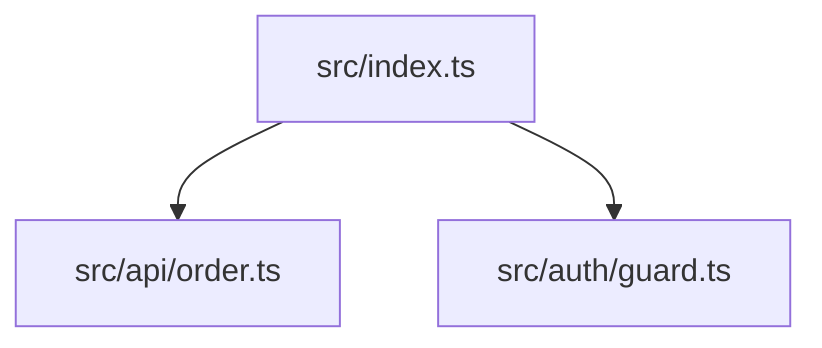

# code-to-gate CLI Reference

This document provides a complete reference for all `code-to-gate` CLI commands, options, exit codes, and output formats.

## Table of Contents

1. [Global Options](#global-options)
2. [Commands](#commands)
   - [scan](#scan)
   - [analyze](#analyze)
   - [diff](#diff)
   - [import](#import)
   - [readiness](#readiness)
   - [export](#export)
   - [schema](#schema)
   - [fixture](#fixture)
3. [Exit Codes](#exit-codes)
4. [Output Formats](#output-formats)
5. [Policy YAML Reference](#policy-yaml-reference)

---

## Global Options

These options apply to all commands:

| Option | Description |
|--------|-------------|
| `--help`, `-h` | Show help message and available commands |
| `--version` | Show version information |

---

## Commands

### scan

Scan a repository and generate a normalized repo graph artifact.

**Usage:**
```bash
code-to-gate scan <repo-path> --out <output-dir>
```

**Arguments:**
| Argument | Required | Description |
|----------|----------|-------------|
| `<repo-path>` | Yes | Path to the repository root directory |

**Options:**
| Option | Default | Description |
|--------|---------|-------------|
| `--out <dir>` | `.qh` | Output directory for generated artifacts |
| `--lang <langs>` | `ts,js` | Target languages (comma-separated: `ts,js,tsx,jsx,py,rb,go,rs,java,php`) |
| `--ignore <patterns>` | `node_modules,dist,.git` | Exclusion patterns (comma-separated) |
| `--verbose` | false | Enable verbose logging |

**Default Exclusions:**

The scanner automatically excludes these directories:
- `.git` - Git metadata
- `node_modules` - Node.js dependencies
- `.qh`, `.qh*` - Output directories (pattern match)
- `dist` - Build output
- `coverage` - Coverage reports
- `.cache` - Cache files
- `__pycache__` - Python cache
- `.svn`, `.hg` - Other VCS metadata

**Output:**
- `.qh/repo-graph.json` - Normalized repository structure with files, modules, symbols, relations, tests, configs, and entrypoints

**Example:**
```bash
# Basic scan
code-to-gate scan ./my-repo --out .qh

# Scan TypeScript files only
code-to-gate scan ./my-repo --out .qh --lang ts,tsx

# Exclude additional directories
code-to-gate scan ./my-repo --out .qh --ignore node_modules,dist,coverage,.env
```

**Exit Codes:**
| Code | Name | Description |
|------|------|-------------|
| 0 | OK | Scan completed successfully |
| 2 | USAGE_ERROR | Invalid path or arguments |
| 3 | SCAN_FAILED | Parser encountered fatal error |

---

### analyze

Run full analysis: scan + evaluate + report generation. This is the primary command for quality assessment.

**Usage:**
```bash
code-to-gate analyze <repo-path> --out <output-dir>
```

**Arguments:**
| Argument | Required | Description |
|----------|----------|-------------|
| `<repo-path>` | Yes | Path to the repository root directory |

**Options:**
| Option | Default | Description |
|--------|---------|-------------|
| `--out <dir>` | `.qh` | Output directory for generated artifacts |
| `--emit <formats>` | `all` | Output formats: `all`, `md`, `json`, `yaml`, `mermaid`, `sarif` |
| `--policy <path>` | none | Path to policy YAML file for release readiness evaluation |
| `--require-llm` | false | Require LLM processing to succeed (exit 4 if failed) |
| `--llm-provider <provider>` | none | LLM provider: `openai`, `anthropic`, `alibaba`, `openrouter`, `ollama`, `llama.cpp` |
| `--llm-model <model>` | provider default | Model name for the selected provider |
| `--llm-model-path <path>` | none | Model file path for `llama.cpp` provider |
| `--lang <langs>` | `ts,js` | Target languages (comma-separated: `ts,js,tsx,jsx,py,rb,go,rs,java,php`) |
| `--ignore <patterns>` | `node_modules,dist,.git` | Exclusion patterns |

**Output Artifacts:**
| Artifact | Description |
|----------|-------------|
| `repo-graph.json` | Normalized repository structure |
| `findings.json` | Quality findings with evidence |
| `risk-register.yaml` | Risk register with severity and recommended actions |
| `invariants.yaml` | Invariant candidates derived from findings |
| `test-seeds.json` | Test design seeds for QA |
| `release-readiness.json` | Release readiness assessment |
| `audit.json` | Run metadata for reproducibility |
| `analysis-report.md` | Human-readable summary report |
| `results.sarif` | SARIF format for GitHub Code Scanning |

**Example:**
```bash
# Basic analysis (deterministic only)
code-to-gate analyze ./my-repo --emit all --out .qh

# With OpenAI LLM
code-to-gate analyze ./my-repo --emit all --out .qh \
  --llm-provider openai --llm-model gpt-4

# With local ollama
code-to-gate analyze ./my-repo --emit all --out .qh \
  --llm-provider ollama --llm-model llama3

# With llama.cpp local model
code-to-gate analyze ./my-repo --emit all --out .qh \
  --llm-provider llama.cpp --llm-model-path ./models/qwen3.gguf

# With policy and LLM required
code-to-gate analyze ./my-repo --emit all --out .qh \
  --policy ./policies/strict.yaml --require-llm
```

**Exit Codes:**
| Code | Name | Description |
|------|------|-------------|
| 0 | OK / PASSED | Analysis passed or passed with risk |
| 1 | NEEDS_REVIEW | Review required due to findings |
| 2 | USAGE_ERROR | Invalid arguments |
| 4 | LLM_FAILED | LLM processing failed (--require-llm mode) |
| 10 | INTERNAL_ERROR | Unexpected internal error |

---

### diff

Analyze differences between two Git references and estimate blast radius.

**Usage:**
```bash
code-to-gate diff <repo-path> --base <ref> --head <ref> --out <output-dir>
```

**Arguments:**
| Argument | Required | Description |
|----------|----------|-------------|
| `<repo-path>` | Yes | Path to the repository root directory |

**Options:**
| Option | Default | Description |
|--------|---------|-------------|
| `--base <ref>` | `main` | Base branch or commit reference |
| `--head <ref>` | `HEAD` | Head branch or commit reference |
| `--out <dir>` | `.qh` | Output directory for generated artifacts |

**Output:**
| Artifact | Description |
|----------|-------------|
| `diff.json` | Changed files, affected entrypoints, and blast radius analysis |

**Example:**
```bash
# Compare branches
code-to-gate diff ./my-repo --base main --head feature-x --out .qh

# Compare commits
code-to-gate diff ./my-repo --base abc123 --head def456 --out .qh
```

**Exit Codes:**
| Code | Name | Description |
|------|------|-------------|
| 0 | OK | Diff analysis completed |
| 2 | USAGE_ERROR | Invalid arguments or repository path |

---

### import

Import results from external analysis tools and convert to normalized findings.

**Usage:**
```bash
code-to-gate import <tool> <file> --out <output-dir>
```

**Arguments:**
| Argument | Required | Description |
|----------|----------|-------------|
| `<tool>` | Yes | Tool name: `semgrep`, `eslint`, `tsc`, `coverage` |
| `<file>` | Yes | Path to the tool output file |

**Options:**
| Option | Default | Description |
|--------|---------|-------------|
| `--out <dir>` | `.qh/imports` | Output directory for imported findings |

**Supported Tools:**
| Tool | Input Format | Notes |
|------|-------------|-------|
| `semgrep` | JSON (`--json` output) | Security and code pattern findings |
| `eslint` | JSON formatter output | Code quality and style findings |
| `tsc` | TypeScript diagnostics JSON | Type errors and warnings |
| `coverage` | Istanbul/nyc coverage-summary.json | Coverage metrics and gaps |

**Output:**
- `.qh/imports/<tool>-findings.json` - Normalized findings from the external tool

**Example:**
```bash
# Import Semgrep results
code-to-gate import semgrep ./semgrep-results.json --out .qh/imports

# Import ESLint results
code-to-gate import eslint ./eslint-output.json --out .qh/imports

# Import TypeScript compiler diagnostics
code-to-gate import tsc ./tsc-errors.json --out .qh/imports

# Import coverage summary
code-to-gate import coverage ./coverage-summary.json --out .qh/imports
```

**Exit Codes:**
| Code | Name | Description |
|------|------|-------------|
| 0 | OK | Import completed successfully |
| 2 | USAGE_ERROR | Invalid arguments or tool name |
| 8 | IMPORT_FAILED | Failed to parse or process input file |

---

### readiness

Evaluate release readiness using findings and a policy file.

**Usage:**
```bash
code-to-gate readiness <repo-path> --policy <file> --out <output-dir>
```

**Arguments:**
| Argument | Required | Description |
|----------|----------|-------------|
| `<repo-path>` | Yes | Path to the repository root directory |

**Options:**
| Option | Default | Description |
|--------|---------|-------------|
| `--policy <path>` | none | Path to policy YAML file |
| `--out <dir>` | `.qh` | Output directory |

**Output:**
| Artifact | Description |
|----------|-------------|
| `release-readiness.json` | Release status, counts, failed conditions, and recommended actions |

**Status Values:**
| Status | Description |
|--------|-------------|
| `passed` | No findings detected |
| `passed_with_risk` | Low/medium findings present but not blocking |
| `needs_review` | High severity findings require human review |
| `blocked_input` | Critical findings block release |

**Example:**
```bash
# Evaluate with policy
code-to-gate readiness ./my-repo --policy ./policies/strict.yaml --out .qh

# Evaluate with default policy
code-to-gate readiness ./my-repo --out .qh
```

**Exit Codes:**
| Code | Name | Description |
|------|------|-------------|
| 0 | OK | Passed or passed with risk |
| 1 | NEEDS_REVIEW | Review required |
| 2 | USAGE_ERROR | Invalid arguments |

---

### export

Generate integration payloads for downstream systems.

**Usage:**
```bash
code-to-gate export <target> --from <dir> --out <file>
```

**Arguments:**
| Argument | Required | Description |
|----------|----------|-------------|
| `<target>` | Yes | Export target: `gatefield`, `state-gate`, `manual-bb`, `workflow-evidence` |

**Options:**
| Option | Default | Description |
|--------|---------|-------------|
| `--from <dir>` | `.qh` | Source directory containing code-to-gate artifacts |
| `--out <file>` | Required | Output file path |

**Export Targets:**
| Target | Consumer | Purpose |
|--------|----------|---------|
| `gatefield` | agent-gatefield | Static analysis signals for pass/hold/block decisions |
| `state-gate` | agent-state-gate | Evidence summary for agent workflow verdicts |
| `manual-bb` | manual-bb-test-harness | Risk and invariant seeds for black-box test design |
| `workflow-evidence` | workflow-cookbook | Evidence references for CI workflow integration |

**Example:**
```bash
# Export for agent-gatefield
code-to-gate export gatefield --from .qh --out .qh/gatefield-static-result.json

# Export for agent-state-gate
code-to-gate export state-gate --from .qh --out .qh/state-gate-evidence.json

# Export for manual-bb-test-harness
code-to-gate export manual-bb --from .qh --out .qh/manual-bb-seed.json

# Export for workflow-cookbook
code-to-gate export workflow-evidence --from .qh --out .qh/workflow-evidence.json
```

**Exit Codes:**
| Code | Name | Description |
|------|------|-------------|
| 0 | OK | Export completed successfully |
| 2 | USAGE_ERROR | Invalid arguments or unknown target |
| 9 | INTEGRATION_EXPORT_FAILED | Missing required artifacts or export failure |

---

### schema

Validate artifacts against their schemas.

**Usage:**
```bash
code-to-gate schema validate <artifact-or-schema>
```

**Arguments:**
| Argument | Required | Description |
|----------|----------|-------------|
| `<artifact-or-schema>` | Yes | Path to artifact JSON or schema JSON file |

**Behavior:**
- If file ends with `.schema.json`: validates schema document structure
- Otherwise: identifies artifact type and validates against appropriate schema

**Example:**
```bash
# Validate artifact
code-to-gate schema validate .qh/findings.json
code-to-gate schema validate .qh/release-readiness.json

# Validate schema definition
code-to-gate schema validate schemas/findings.schema.json
```

**Exit Codes:**
| Code | Name | Description |
|------|------|-------------|
| 0 | OK | Validation passed |
| 7 | SCHEMA_FAILED | Schema validation errors found |

---

### fixture

Manage fixture repositories for testing and demonstration.

**Usage:**
```bash
code-to-gate fixture <action> [options]
```

**Actions:**
| Action | Description |
|--------|-------------|
| `list` | List available fixtures |
| `validate <name>` | Validate a fixture repository |
| `seed <name>` | Generate seed artifacts for a fixture |

**Options:**
| Option | Default | Description |
|--------|---------|-------------|
| `--fixtures-dir <dir>` | `fixtures` | Directory containing fixtures |

**Example:**
```bash
# List fixtures
code-to-gate fixture list

# Validate fixture
code-to-gate fixture validate demo-shop-ts

# Generate seed artifacts
code-to-gate fixture seed demo-ci-imports --fixtures-dir fixtures
```

**Exit Codes:**
| Code | Name | Description |
|------|------|-------------|
| 0 | OK | Operation completed |
| 2 | USAGE_ERROR | Invalid arguments |
| 3 | FIXTURE_FAILED | Fixture operation failed |

---

## Exit Codes

| Code | Name | Description |
|------|------|-------------|
| 0 | OK | Operation completed successfully |
| 1 | READINESS_NOT_CLEAR | Release readiness requires review or is blocked |
| 2 | USAGE_ERROR | Invalid CLI arguments, paths, or mode |
| 3 | SCAN_FAILED | Repository scan or parser fatal failure |
| 4 | LLM_FAILED | LLM processing failed (--require-llm mode) |
| 5 | POLICY_FAILED | Policy YAML validation failed |
| 7 | SCHEMA_FAILED | Artifact schema validation failed |
| 8 | IMPORT_FAILED | External tool import failed |
| 9 | INTEGRATION_EXPORT_FAILED | Downstream export failed |
| 10 | INTERNAL_ERROR | Unexpected internal error |

---

## Output Formats

### JSON

Standard JSON format with schema versioning. All JSON artifacts include:

```json
{
  "version": "ctg/v1alpha1",
  "generated_at": "2026-04-30T12:00:00Z",
  "run_id": "ctg-20260430120000",
  "repo": { "root": "." },
  "tool": { "name": "code-to-gate", "version": "0.2.0-alpha.1" },
  "artifact": "<artifact-name>",
  "schema": "<artifact>@v1"
}
```

### YAML

Human-readable format for risk-register and invariants:

```yaml
version: ctg/v1alpha1
generated_at: 2026-04-30T12:00:00Z
artifact: risk-register
risks:
  - id: risk-client-supplied-price
    title: Client supplied price may cause financial loss
    severity: critical
    recommendedActions:
      - Recalculate totals from server-side prices
```

### Markdown

Human-readable summary report with sections:

- Executive Summary
- Findings Overview
- Risk Assessment
- Recommended Actions
- Test Seeds
- Release Readiness

### SARIF

Standard SARIF format for GitHub Code Scanning integration:

```json
{
  "$schema": "https://raw.githubusercontent.com/oasis-tcs/sarif-spec/master/Sarif-2.1.0.json",
  "version": "2.1.0",
  "runs": [{
    "tool": { "name": "code-to-gate" },
    "results": [...]
  }]
}
```

### Mermaid

Diagram format for dependency visualization:



---

## Policy YAML Reference

Policy files define blocking thresholds for release readiness evaluation.

```yaml
# policies/strict.yaml
version: ctg/v1alpha1
policy_id: strict

blocking:
  severity:
    critical: true    # Block on critical severity findings
    high: true        # Block on high severity findings
    medium: false     # Don't block on medium
    low: false        # Don't block on low

  category:
    auth: true        # Block on auth category
    payment: true     # Block on payment category
    validation: true  # Block on validation category
    data: false       # Don't block on data category
    config: false
    maintainability: false
    testing: false
    security: true    # Block on security category

  rules:
    CLIENT_TRUSTED_PRICE: true  # Block on specific rule (high/critical only)
    WEAK_AUTH_GUARD: true       # Block on specific rule

  count_threshold:
    critical_max: 0   # Max critical findings allowed
    high_max: 5       # Max high findings allowed
    medium_max: 20    # Max medium findings allowed

confidence:
  min_confidence: 0.6
  low_confidence_threshold: 0.4
  filter_low: true

suppression:
  file: .ctg/suppressions.yaml
  expiry_warning_days: 30
  max_suppressions_per_rule: 10

llm:
  enabled: true
  mode: local-only     # remote | local-only | none
  min_confidence: 0.6
  require_llm: false

partial:
  allow_partial: false
  partial_warning_threshold: 0.2

exit:
  fail_on_critical: true
  fail_on_high: true
  warn_only: false
```

### Blocking Configuration

| Option | Effect |
|--------|--------|
| `blocking.severity.critical: true` | Any critical finding blocks release |
| `blocking.severity.high: true` | Any high finding blocks release |
| `blocking.category.auth: true` | Any auth-related finding blocks release |
| `blocking.category.payment: true` | Any payment-related finding blocks release |
| `blocking.rules.CLIENT_TRUSTED_PRICE: true` | Specific rule blocks release (high/critical severity only) |
| `blocking.count_threshold.critical_max: 0` | Exceed threshold blocks release |

### Confidence Configuration

| Option | Description |
|--------|-------------|
| `min_confidence` | Minimum confidence threshold (0-1) |
| `low_confidence_threshold` | Threshold for low confidence warning |
| `filter_low` | Filter findings below threshold |

### LLM Configuration

| Option | Description |
|--------|-------------|
| `enabled` | Enable LLM integration |
| `mode` | `remote` \| `local-only` \| `none` |
| `min_confidence` | Minimum confidence threshold for LLM content |
| `require_llm` | Fail if LLM unavailable |

### Suppression Configuration

| Option | Description |
|--------|-------------|
| `file` | Path to suppression file |
| `expiry_warning_days` | Warning days before expiry |
| `max_suppressions_per_rule` | Max suppressions per rule |

### Suppression File Format

```yaml
# .ctg/suppressions.yaml
version: ctg/v1alpha1
suppressions:
  -
    rule_id: CLIENT_TRUSTED_PRICE
    path: src/legacy/*
    reason: Legacy code tracked separately
    expiry: 2026-12-31
    author: dev-team
```

### Exit Configuration

| Option | Description |
|--------|-------------|
| `fail_on_critical` | Exit with error on critical findings |
| `fail_on_high` | Exit with error on high findings |
| `warn_only` | Never fail, only warn |
