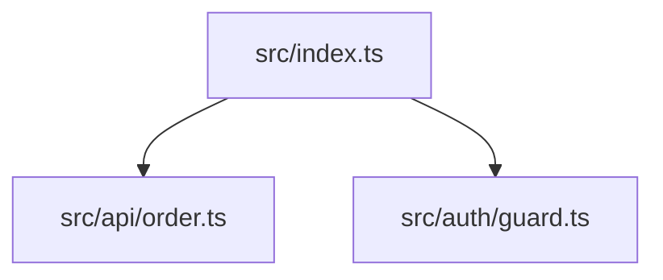

# code-to-gate CLI Reference

This document provides a complete reference for all `code-to-gate` CLI commands, options, exit codes, and output formats.

## Table of Contents

1. [Global Options](#global-options)
2. [Commands](#commands)
   - [scan](#scan)
   - [analyze](#analyze)
   - [diff](#diff)
   - [import](#import)
   - [readiness](#readiness)
   - [export](#export)
   - [viewer](#viewer)
   - [historical](#historical)
   - [spec-drift](#spec-drift)
   - [rule](#rule)
   - [pack](#pack)
   - [doctor](#doctor)
   - [test-plan](#test-plan)
   - [ownership](#ownership)
   - [release-pack](#release-pack)
   - [plugin-marketplace](#plugin-marketplace)
   - [llm-health](#llm-health)
   - [evidence](#evidence)
   - [plugin-sandbox](#plugin-sandbox)
   - [assurance](#assurance)
   - [schema](#schema)
3. [Exit Codes](#exit-codes)
4. [Output Formats](#output-formats)
5. [Policy YAML Reference](#policy-yaml-reference)

---

## Global Options

These options apply to all commands:

| Option | Description |
|--------|-------------|
| `--help`, `-h` | Show help message and available commands |
| `--version` | Show version information |

---

## Commands

### Responsibility Boundaries

| Command | Responsibility | Primary Outputs |
|---------|----------------|-----------------|
| `scan` | Build a normalized repository graph. It does not evaluate release policy. | `repo-graph.json`, optional `database-assets.json` |
| `analyze` | Run scan plus rules/report generation. It does not create release-readiness. | `raw-findings.json`, `findings.json`, `risk-register.yaml`, `analysis-report.md`, `test-seeds.json`, `invariants.json`, `repo-graph.json`, `audit.json` |
| `readiness` | Evaluate existing analysis artifacts against policy. Requires `--from <artifact-dir>`. | `release-readiness.json` |
| `export` | Transform existing artifacts for downstream tools and evidence graph consumers. | Target-specific JSON/SARIF, `evidence-dag.json` |
| `spec-drift` | Compare public docs, CLI help, schema registration, and schema coverage tests. | `spec-drift.json` |
| `rule` | Scaffold custom TypeScript rules with fixture-based tests and local manifest schema. | `.ctg/rules/<id>/` |
| `pack` | List packaged quality profiles, emit their contracts, and export policy YAML. | `quality-pack.json`, `.ctg/policy.yaml` |
| `doctor` | Diagnose local/CI readiness for code-to-gate workflows. | `doctor.json` |
| `test-plan` | Select recommended tests from repo graph and diff blast radius. | `test-plan.json` |
| `ownership` | Resolve CODEOWNERS reviewer candidates and module ownership risk. | `ownership-risk.json` |
| `viewer` | Generate a standalone HTML report from existing artifacts. | `viewer-report.html`, optional `hosted-static-report.json` |
| `release-pack` | Assemble release review evidence into a manifest, HTML report, and ZIP archive. | `release-pack.json`, `release-pack.html`, `release-pack.zip` |
| `plugin-marketplace` | Build a validated local plugin registry for distribution review. | `plugin-marketplace.json` |

### scan

Scan a repository and generate a normalized repo graph artifact.

**Usage:**
```bash
code-to-gate scan <repo-path> --out <output-dir>
```

**Arguments:**
| Argument | Required | Description |
|----------|----------|-------------|
| `<repo-path>` | Yes | Path to the repository root directory |

**Options:**
| Option | Default | Description |
|--------|---------|-------------|
| `--out <dir>` | `.qh` | Output directory for generated artifacts |
| `--tree-sitter` | false | Use tree-sitter WASM parser for Python/Ruby/Go/Rust (more accurate AST parsing) |
| `--verbose` | false | Enable verbose logging |
| `--cache <mode>` | `enabled` | Cache mode: `enabled`, `disabled`, `force` |
| `--parallel <n>` | `4` | Max parallel workers for file parsing |
| `--database-analysis` | false | Enable SQL and migration risk analysis |

Note: current CLI help does not expose `--lang`, `--languages`, `--ignore`, or `--exclude`; language detection and default exclusions are handled by the scanner.

**Default Exclusions:**

The scanner automatically excludes these directories:
- `.git` - Git metadata
- `node_modules` - Node.js dependencies
- `.qh`, `.qh*` - Output directories (pattern match)
- `dist` - Build output
- `coverage` - Coverage reports
- `.cache` - Cache files
- `__pycache__` - Python cache
- `.svn`, `.hg` - Other VCS metadata

**Output:**
- `.qh/repo-graph.json` - Normalized repository structure with files, modules, symbols, relations, tests, configs, and entrypoints

**Example:**
```bash
# Basic scan
code-to-gate scan ./my-repo --out .qh

# Enable database analysis
code-to-gate scan ./my-repo --out .qh --database-analysis
```

**Exit Codes:**
| Code | Name | Description |
|------|------|-------------|
| 0 | OK | Scan completed successfully |
| 2 | USAGE_ERROR | Invalid path or arguments |
| 3 | SCAN_FAILED | Parser encountered fatal error |

---

### analyze

Run full analysis: scan + evaluate + report generation. This is the primary command for quality assessment.

**Usage:**
```bash
code-to-gate analyze <repo-path> --out <output-dir>
```

**Arguments:**
| Argument | Required | Description |
|----------|----------|-------------|
| `<repo-path>` | Yes | Path to the repository root directory |

**Options:**
| Option | Default | Description |
|--------|---------|-------------|
| `--out <dir>` | `.qh` | Output directory for generated artifacts |
| `--emit <formats>` | `all` | Output formats: `all`, `md`, `json`, `yaml`, `mermaid`, `sarif` |
| `--policy <path>` | none | Path to policy YAML file for release readiness evaluation |
| `--format <format>` | `json` | Machine stdout summary format. Only `json` is stable for `analyze`. |
| `--quiet` | false | Suppress successful stdout summary. Human and JSON diagnostics still go to stderr. |
| `--require-llm` | false | Require LLM processing to succeed (exit 4 if failed) |
| `--llm-provider <provider>` | none | LLM provider: `openai`, `anthropic`, `alibaba`, `openrouter`, `ollama`, `llama.cpp` |
| `--llm-model <model>` | provider default | Model name for the selected provider |
| `--llm-model-path <path>` | none | Model file path for `llama.cpp` provider |
| `--llm-mode <mode>` | `local-only` | LLM policy mode: `local-only` or `allow-cloud`; provider selection stays in `--llm-provider` |
| `--debug-llm-trace` | false | Write `llm-trace.json` with redacted LLM request/response and hashes. This file is not listed as a public audit artifact. |
| `--database-analysis` | false | Enable database migration analysis for risky schema changes |

**Output Artifacts:**
| Artifact | Description |
|----------|-------------|
| `raw-findings.json` | Pre-normalization findings emitted by rule evaluation |
| `repo-graph.json` | Normalized repository structure |
| `findings.json` | Quality findings with evidence |
| `risk-register.yaml` | Risk register with severity and recommended actions when YAML/all output is requested |
| `invariants.json` | Invariant candidates derived from findings |
| `test-seeds.json` | Test design seeds for QA |
| `release-readiness.json` | Generated by `readiness --from <artifact-dir>`, not by `analyze` |
| `audit.json` | Run metadata for reproducibility |
| `analysis-report.md` | Human-readable summary report when markdown output is requested |
| `results.sarif` | SARIF format when SARIF output is requested |
| `database-assets.json` | SQL/migration inventory when `--database-analysis` is enabled |

**CLI Output Contract:**

- Successful `analyze` runs write one JSON summary line to stdout by default.
- The summary line has `schema: "ctg.cli.summary@v1"` and includes `tool`, `command`, `status`, `exit_code`, `run_id`, `artifacts`, and `summary`.
- `--format json` is the only stable machine stdout format for `analyze`.
- `--quiet` suppresses the success summary on stdout but does not suppress stderr diagnostics.
- Errors write human-readable text to stderr and also emit a JSON diagnostic line with `schema: "ctg.cli.diagnostic@v1"`.

**Example:**
```bash
# Basic analysis (deterministic only)
code-to-gate analyze ./my-repo --emit all --out .qh

# With OpenAI LLM
code-to-gate analyze ./my-repo --emit all --out .qh \
  --llm-provider openai --llm-model gpt-4

# With local ollama
code-to-gate analyze ./my-repo --emit all --out .qh \
  --llm-provider ollama --llm-model llama3

# With llama.cpp local model
code-to-gate analyze ./my-repo --emit all --out .qh \
  --llm-provider llama.cpp --llm-model-path ./models/qwen3.gguf

# With policy and LLM required
code-to-gate analyze ./my-repo --emit all --out .qh \
  --policy ./policies/strict.yaml --require-llm

# With database migration analysis
code-to-gate analyze ./my-repo --emit all --out .qh \
  --database-analysis
```

**Database Analysis:**

When `--database-analysis` is enabled, code-to-gate scans database migration files for risky schema changes that could cause data loss, service disruption, or require manual intervention.

**Supported Inputs:**

- `.sql` DDL is the initial supported input.
- Migration source files containing embedded SQL are inspected on a best-effort basis.
- ORM-specific migration semantics are not fully interpreted.

**Database Rules:**

| Rule ID | Category | Description |
|---------|----------|-------------|
| `DB_DROP_TABLE` | data | DROP TABLE without transaction/rollback safeguards |
| `DB_DROP_COLUMN` | data | Column removal without documented rollback path |
| `DB_ADD_NOT_NULL_WITHOUT_DEFAULT` | data | Adding NOT NULL constraint without default value |
| `DB_RISKY_TYPE_CHANGE` | data | Type narrowing (bigint→integer, decimal→integer) |
| `DB_DROP_CONSTRAINT` | data | Dropping foreign key, unique, or check constraints |
| `DB_DROP_INDEX` | data | Index removal without rollback consideration |
| `DB_MIGRATION_NO_TRANSACTION_SIGNAL` | data | Missing transaction wrapper signals (BEGIN/COMMIT) |
| `DB_ROLLBACK_NOT_EVIDENCED` | data | Rollback path not documented or implemented |

**Severity:**

- **High**: Operations without rollback evidence (e.g., DROP TABLE with no down method)
- **Medium**: Operations with rollback evidence but still risky (e.g., DROP COLUMN with documented down)

**Exit Codes:**
| Code | Name | Description |
|------|------|-------------|
| 0 | OK / PASSED | Analysis passed or passed with risk |
| 1 | NEEDS_REVIEW | Review required due to findings |
| 2 | USAGE_ERROR | Invalid arguments |
| 4 | LLM_FAILED | LLM processing failed (--require-llm mode) |
| 10 | INTERNAL_ERROR | Unexpected internal error |

---

### diff

Analyze differences between two Git references and estimate blast radius.

**Usage:**
```bash
code-to-gate diff <repo-path> --base <ref> --head <ref> --out <output-dir>
```

**Arguments:**
| Argument | Required | Description |
|----------|----------|-------------|
| `<repo-path>` | Yes | Path to the repository root directory |

**Options:**
| Option | Default | Description |
|--------|---------|-------------|
| `--base <ref>` | `main` | Base branch or commit reference |
| `--head <ref>` | `HEAD` | Head branch or commit reference |
| `--out <dir>` | `.qh` | Output directory for generated artifacts |
| `--blast-depth <n>` | `1` | Importer traversal depth for blast radius. `1` includes direct importers; higher values include transitive importers up to 10. |
| `--database-analysis` | false | Enable database migration analysis for risky schema changes |

**Output:**
| Artifact | Description |
|----------|-------------|
| `diff.json` | Changed files, affected entrypoints, and blast radius analysis |

**Example:**
```bash
# Compare branches
code-to-gate diff ./my-repo --base main --head feature-x --out .qh

# Compare commits
code-to-gate diff ./my-repo --base abc123 --head def456 --out .qh

# With database migration analysis (PR review)
code-to-gate diff ./my-repo --base main --head feature-migration \
  --database-analysis --out .qh
```

**Exit Codes:**
| Code | Name | Description |
|------|------|-------------|
| 0 | OK | Diff analysis completed |
| 2 | USAGE_ERROR | Invalid arguments or repository path |

---

### import

Import results from external analysis tools and convert to normalized findings.

**Usage:**
```bash
code-to-gate import <tool> <file> --out <output-dir>
```

**Arguments:**
| Argument | Required | Description |
|----------|----------|-------------|
| `<tool>` | Yes | Tool name: `semgrep`, `eslint`, `sarif`, `codeql`, `tsc`, `coverage`, `test` |
| `<file>` | Yes | Path to the tool output file |

**Options:**
| Option | Default | Description |
|--------|---------|-------------|
| `--out <dir>` | `.qh/imports` | Output directory for imported findings |

**Supported Tools:**
| Tool | Input Format | Notes |
|------|-------------|-------|
| `semgrep` | JSON (`--json` output) | Security and code pattern findings |
| `eslint` | JSON formatter output | Code quality and style findings |
| `sarif` | SARIF 2.1.0 | Generic SARIF result import |
| `codeql` | CodeQL SARIF 2.1.0 | CodeQL result import with SARIF severity metadata |
| `tsc` | TypeScript diagnostics JSON | Type errors and warnings |
| `coverage` | Istanbul/nyc coverage-summary.json | Coverage metrics and gaps |
| `test` | Generic test result JSON | Failed tests as testing findings |

**Output:**
- `.qh/imports/<tool>-findings.json` - Normalized findings from the external tool

**Example:**
```bash
# Import Semgrep results
code-to-gate import semgrep ./semgrep-results.json --out .qh/imports

# Import ESLint results
code-to-gate import eslint ./eslint-output.json --out .qh/imports

# Import SARIF or CodeQL results
code-to-gate import sarif ./results.sarif --out .qh/imports
code-to-gate import codeql ./codeql-results.sarif --out .qh/imports

# Import TypeScript compiler diagnostics
code-to-gate import tsc ./tsc-errors.json --out .qh/imports

# Import coverage summary
code-to-gate import coverage ./coverage-summary.json --out .qh/imports
```

**Exit Codes:**
| Code | Name | Description |
|------|------|-------------|
| 0 | OK | Import completed successfully |
| 2 | USAGE_ERROR | Invalid arguments or tool name |
| 8 | IMPORT_FAILED | Failed to parse or process input file |

---

### readiness

Evaluate release readiness using findings and a policy file.

**Usage:**
```bash
code-to-gate readiness <repo-path> --policy <file> --from <artifact-dir> --out <output-dir> [--baseline <file-or-dir>] [--manual-evidence <file>]
```

**Arguments:**
| Argument | Required | Description |
|----------|----------|-------------|
| `<repo-path>` | Yes | Path to the repository root directory |

**Options:**
| Option | Default | Description |
|--------|---------|-------------|
| `--policy <path>` | none | Path to policy YAML file |
| `--from <dir>` | none | Source directory containing `findings.json` from `analyze` |
| `--out <dir>` | `.qh` | Output directory |
| `--intake <file>` | none | Optional planning artifact such as `project-intake.json` or `phase-contract.yaml`; unresolved critical input issues force `blocked_input` |
| `--baseline <file-or-dir>` | none | Baseline `findings.json`, artifact directory, or `release-readiness.json` for ratchet gating. When present, policy evaluation only gates new or severity-worsened findings. |
| `--manual-evidence <file>` | none | Manual BB evidence artifact used by Policy DSL `manual_evidence` conditions. |

**Output:**
| Artifact | Description |
|----------|-------------|
| `release-readiness.json` | Release status, counts, failed conditions, and recommended actions |

**Status Values:**
| Status | Description |
|--------|-------------|
| `passed` | No findings detected |
| `passed_with_risk` | Low/medium findings present but not blocking |
| `needs_review` | High severity findings require human review |
| `blocked_input` | Critical findings block release |

**Example:**
```bash
# Evaluate with policy
code-to-gate readiness ./my-repo --policy ./policies/strict.yaml --from .qh --out .qh

# Include planning/phase-contract evidence
code-to-gate readiness ./my-repo --policy ./policies/strict.yaml --from .qh --out .qh \
  --intake ./phase-contract.yaml

# Ratchet gate against a previous run
code-to-gate readiness ./my-repo --policy ./policies/strict.yaml --from .qh/current --out .qh/current \
  --baseline .qh/previous/findings.json

# Include manual BB evidence for Policy DSL
code-to-gate readiness ./my-repo --policy ./policies/dsl.yaml --from .qh --out .qh \
  --manual-evidence .qh/manual-bb.json
```

**Baseline / Ratchet Behavior:**

- Existing baseline findings remain visible in `counts` and `baseline` summary.
- Only new findings and findings whose severity worsened are passed into policy evaluation.
- A baseline path may point to `findings.json`, a directory containing `findings.json` or `baseline-findings.json`, or a `release-readiness.json` whose sibling or `artifactRefs.findings` can resolve the previous findings artifact.
- `release-readiness.json.baseline.gatedFindingIds` lists the finding IDs that were actually evaluated by the ratchet gate.

**Exit Codes:**
| Code | Name | Description |
|------|------|-------------|
| 0 | OK | Passed or passed with risk |
| 1 | NEEDS_REVIEW | Review required |
| 2 | USAGE_ERROR | Invalid arguments |

---

### export

Generate integration payloads for downstream systems.

**Usage:**
```bash
code-to-gate export <target> --from <dir> --out <file>
```

**Arguments:**
| Argument | Required | Description |
|----------|----------|-------------|
| `<target>` | Yes | Export target: `gatefield`, `state-gate`, `manual-bb`, `workflow-evidence`, `sarif`, `qeg-code-to-gate`, `evidence-dag` |

**Options:**
| Option | Default | Description |
|--------|---------|-------------|
| `--from <dir>` | `.qh` | Source directory containing code-to-gate artifacts |
| `--out <file>` | Required | Output file path |

**Export Targets:**
| Target | Consumer | Purpose |
|--------|----------|---------|
| `gatefield` | agent-gatefield | Static analysis signals for pass/hold/block decisions |
| `state-gate` | agent-state-gate | Evidence summary for agent workflow verdicts |
| `manual-bb` | manual-bb-test-harness | Risk and invariant seeds for black-box test design |
| `workflow-evidence` | workflow-cookbook | Evidence references for CI workflow integration |
| `sarif` | GitHub Code Scanning / SARIF consumers | SARIF 2.1.0 findings export |
| `qeg-code-to-gate` | quality-evidence-graph | Evidence-only export for QEG processing |
| `evidence-dag` | code-to-gate / QEG / PR reviewer surfaces | Cross-artifact DAG linking requirements, rules, findings, artifacts, manual evidence, CI runs, and verdicts |

**Example:**
```bash
# Export for agent-gatefield
code-to-gate export gatefield --from .qh --out .qh/gatefield-static-result.json

# Export for agent-state-gate
code-to-gate export state-gate --from .qh --out .qh/state-gate-evidence.json

# Export for manual-bb-test-harness
code-to-gate export manual-bb --from .qh --out .qh/manual-bb-seed.json

# Export for workflow-cookbook
code-to-gate export workflow-evidence --from .qh --out .qh/workflow-evidence.json

# Export SARIF
code-to-gate export sarif --from .qh --out .qh/results.sarif

# Export for quality-evidence-graph
code-to-gate export qeg-code-to-gate --from .qh --out .qh/qeg-code-to-gate.json

# Export cross-artifact evidence DAG
code-to-gate export evidence-dag --from .qh --out .qh/evidence-dag.json
```

**Exit Codes:**
| Code | Name | Description |
|------|------|-------------|
| 0 | OK | Export completed successfully |
| 2 | USAGE_ERROR | Invalid arguments or unknown target |
| 9 | INTEGRATION_EXPORT_FAILED | Missing required artifacts or export failure |

---

### viewer

Generate a standalone HTML report from an artifact directory.

**Usage:**
```bash
code-to-gate viewer --from <dir> [--out <file>] [--title <title>] [--dark] [--hosted] [--public-url <url>] [--hosted-target <target>]
```

**Options:**
| Option | Default | Description |
|--------|---------|-------------|
| `--from <dir>` | Required | Source artifact directory |
| `--out <file>` | stdout/default path | HTML output path |
| `--title <title>` | `code-to-gate Report` | Report title |
| `--dark` | false | Render dark theme |
| `--hosted` | false | Generate `hosted-static-report.json` next to the HTML output |
| `--public-url <url>` | none | Expected URL after publishing the HTML report |
| `--hosted-target <target>` | `generic-static` | Static host target: `github-pages`, `artifact-preview`, or `generic-static` |

**Output:**
| Artifact | Description |
|----------|-------------|
| `viewer-report.html` | Single-file HTML report with embedded CSS and JavaScript |
| `hosted-static-report.json` | Hosted report manifest with HTML hash, size, source artifact hashes, target, and optional public URL |

**Example:**
```bash
code-to-gate viewer --from .qh --out .qh/report.html --title "Release Review"
code-to-gate viewer --from .qh --out public/index.html --hosted \
  --hosted-target github-pages --public-url https://example.github.io/repo/
code-to-gate schema validate public/hosted-static-report.json
```

When `.qh/qeg-code-to-gate.json` or `.qh/evidence-dag.json` exists, the viewer
adds a QEG tab with readiness status, schema compliance, artifact hashes,
Evidence DAG finding drill-down, and manual test candidates.

Hosted mode keeps the report as a single HTML file for GitHub Pages, artifact
preview, or a generic static file server. The adjacent manifest records
`hosted-static-report@v1`, the HTML SHA-256 hash, source artifact hashes, and
the declared static hosting target.

---

### historical

Compare current and previous artifact directories and optionally include trend history.

**Usage:**
```bash
code-to-gate historical --current <dir> --previous <dir> [--out <file>] [--history <dir>]
```

**Options:**
| Option | Default | Description |
|--------|---------|-------------|
| `--current <dir>` | Required | Current run artifact directory |
| `--previous <dir>` | Required | Previous run artifact directory |
| `--out <file>` | stdout/default path | Historical comparison output |
| `--history <dir>` | none | Directory containing multiple historical runs |

**Output:**
| Artifact | Description |
|----------|-------------|
| `historical-comparison.json` | New/resolved/regressed findings, readiness delta, risk trend, and timeline history points |

**Example:**
```bash
code-to-gate historical --current .qh/current --previous .qh/previous --history .qh/runs \
  --out .qh/current/historical-comparison.json
code-to-gate schema validate .qh/current/historical-comparison.json
code-to-gate viewer --from .qh/current --out .qh/current/report.html
```

---

### spec-drift

Detect drift between the public contract and implementation surfaces.

**Usage:**
```bash
code-to-gate spec-drift <repo> --out <dir>
```

**Arguments:**
| Argument | Required | Description |
|----------|----------|-------------|
| `<repo>` | Yes | Repository root to inspect |

**Options:**
| Option | Default | Description |
|--------|---------|-------------|
| `--out <dir>` | `.qh` | Output directory for `spec-drift.json` |
| `--quiet` | false | Suppress the JSON stdout summary |

**Checks:**
| Check | Description |
|-------|-------------|
| command drift | Verifies `SUPPORTED_TARGETS` is reflected in top-level CLI help and this CLI reference |
| schema drift | Verifies documented public artifacts have schemas and public schemas are preloaded by schema validation |
| test drift | Verifies public schemas are explicitly covered by schema coverage tests |
| status drift | Verifies required docs, schema, implementation, and test surfaces exist |

**Output:**
| Artifact | Description |
|----------|-------------|
| `spec-drift.json` | Drift checks, release-risk findings, and summary counts |

**Exit Codes:**
| Code | Name | Description |
|------|------|-------------|
| 0 | OK | No drift detected |
| 1 | READINESS_NOT_CLEAR | Drift detected and emitted as release-risk findings |
| 2 | USAGE_ERROR | Invalid arguments or repository path |
| 10 | INTERNAL_ERROR | Unexpected internal error |

---

### rule

Create custom rule scaffolds for teams that want to extend code-to-gate without
editing the OSS core rule directory.

**Usage:**
```bash
code-to-gate rule new <id> [--out <dir>] [--category <category>] [--severity <severity>] [--description <text>] [--force]
```

**Commands:**
| Command | Description |
|---------|-------------|
| `new <id>` | Create a TypeScript rule scaffold under `<out>/<id>` |

**Options:**
| Option | Default | Description |
|--------|---------|-------------|
| `--out <dir>` | `.ctg/rules` | Scaffold root. The command creates `<dir>/<id>`. |
| `--category <category>` | `security` | Finding category such as `security`, `payment`, `auth`, or `validation`. |
| `--severity <severity>` | `high` | Default finding severity: `low`, `medium`, `high`, or `critical`. |
| `--description <text>` | generated | Rule description written to `rule.ts`, `README.md`, and `rule.manifest.json`. |
| `--force` | false | Overwrite an existing scaffold directory. |

**Generated Files:**
| Path | Purpose |
|------|---------|
| `rule.ts` | RulePlugin implementation using `@quality-harness/code-to-gate/rule-sdk` |
| `index.ts` | Rule export entry point |
| `rule.test.ts` | Vitest fixture harness |
| `fixtures/positive.ts` | Positive fixture with a detectable marker |
| `fixtures/negative.ts` | Negative fixture |
| `rule.manifest.json` | Rule metadata |
| `schema/rule.manifest.schema.json` | Local scaffold manifest schema |
| `README.md` | Rule authoring notes |

**Example:**
```bash
code-to-gate rule new unsafe-redirect --category security --severity high
code-to-gate rule new payment-total --category payment --severity critical --out .ctg/rules
```

**Exit Codes:**
| Code | Name | Description |
|------|------|-------------|
| 0 | OK | Rule scaffold was created |
| 2 | USAGE_ERROR | Invalid rule id, category, severity, or existing target without `--force` |

---

### pack

Use bundled Quality Packs to bootstrap policy and evidence workflows without
hand-authoring the first `.ctg/policy.yaml`.

**Usage:**
```bash
code-to-gate pack list [--quiet]
code-to-gate pack show <id> [--out <file-or-dir>] [--quiet]
code-to-gate pack export-policy <id> --out <file> [--quiet]
```

**Commands:**
| Command | Description |
|---------|-------------|
| `list` | List bundled pack IDs, names, maturity, and tags. |
| `show <id>` | Emit the full `quality-pack@v1` contract to stdout or `quality-pack.json`. |
| `export-policy <id>` | Write a readiness-compatible policy YAML for the selected pack. |

**Initial Packs:**
| Pack | Focus |
|------|-------|
| `security-basic` | Secrets, auth, validation, redirects, rate limits, and SQL risks |
| `release-evidence` | Suppression debt, untested critical paths, debt markers, and evidence exports |
| `frontend-risk` | Client-trusted values, server validation, redirects, env access, and deprecated APIs |
| `api-contract` | Backend auth, request validation, rate limits, SQL, and database changes |
| `ai-generated-code` | Generated-code review risks such as swallowed errors, validation gaps, and test gaps |
| `compliance-lite` | Lightweight audit posture for secrets, env usage, debt, and data changes |

**Options:**
| Option | Default | Description |
|--------|---------|-------------|
| `--out <file-or-dir>` | stdout for `show`, required file for `export-policy` | Output destination. `show` writes `quality-pack.json` when given a directory. |
| `--quiet` | false | Suppress stdout JSON summary. |

**Output:**
| Artifact | Description |
|----------|-------------|
| `quality-pack.json` | Pack contract, recommended commands, rule profile, policy profile, and expected exports |
| `.ctg/policy.yaml` | Policy YAML usable by `analyze` and `readiness` |

**Example:**
```bash
code-to-gate pack list
code-to-gate pack show security-basic --out .qh
code-to-gate pack export-policy security-basic --out .ctg/policy.yaml
code-to-gate analyze . --policy .ctg/policy.yaml --emit all --out .qh
```

**Exit Codes:**
| Code | Name | Description |
|------|------|-------------|
| 0 | OK | Pack command completed |
| 2 | USAGE_ERROR | Unknown pack, unknown subcommand, or invalid arguments |

---

### doctor

Diagnose local and CI readiness before running quality gates.

**Usage:**
```bash
code-to-gate doctor [--out <file-or-dir>] [--from <artifact-dir>] [--require-docker] [--quiet]
```

**Options:**
| Option | Default | Description |
|--------|---------|-------------|
| `--out <file-or-dir>` | `.qh/doctor.json` | Output file. If a directory is provided, writes `doctor.json` inside it. |
| `--from <artifact-dir>` | none | Optional artifact directory to verify before downstream validation. |
| `--require-docker` | false | Treat missing Docker as a failed check for plugin sandbox workflows. |
| `--quiet` | false | Suppress stdout JSON summary. |

**Checks:**
| Check | Category | Behavior |
|-------|----------|----------|
| `runtime.node` | runtime | Fails when Node.js is older than 20. |
| `tooling.git` | tooling | Warns when Git is not available on PATH. |
| `tooling.docker` | tooling | Passes when Docker is available; fails only with `--require-docker`. |
| `filesystem.output` | filesystem | Fails when the output directory cannot be written. |
| `schema.bundle` | schema | Fails when packaged schemas are missing. |
| `artifact.from` | artifact | Fails when `--from` points to a missing artifact directory. |
| `ci.github-actions` | ci | Records GitHub Actions context when present. |

**Output:**
| Artifact | Description |
|----------|-------------|
| `doctor.json` | Diagnostic checks, status, and remediation hints |

**Exit Codes:**
| Code | Name | Description |
|------|------|-------------|
| 0 | OK | No failed checks |
| 1 | READINESS_NOT_CLEAR | One or more checks failed |
| 2 | USAGE_ERROR | Invalid arguments |

---

### test-plan

Generate a deterministic test selection artifact from existing code-to-gate
artifacts. The command prefers `diff-analysis.json` blast-radius data and uses
`repo-graph.json` to map changed source files to test files.

**Usage:**
```bash
code-to-gate test-plan --from <artifact-dir> [--out <file-or-dir>] [--quiet]
```

**Options:**
| Option | Default | Description |
|--------|---------|-------------|
| `--from <artifact-dir>` | `.qh` | Directory containing `repo-graph.json` and optional `diff-analysis.json`. |
| `--out <file-or-dir>` | `<from>/test-plan.json` | Output file. If a directory is provided, writes `test-plan.json` inside it. |
| `--quiet` | false | Suppress stdout JSON summary. |

**Output:**
| Artifact | Description |
|----------|-------------|
| `test-plan.json` | Changed files, affected files, recommended tests, and oracle gaps |

**Behavior:**
- Uses `diff-analysis.json.blast_radius.affectedTests` as first-priority test evidence.
- Falls back to deterministic path matching such as `src/foo.ts` -> `src/foo.test.ts`.
- Emits `oracleGaps` for changed source files with no mapped automated test.
- Uses `status: "needs_manual_oracle"` when manual/oracle gaps remain.

**Example:**
```bash
code-to-gate diff . --base main --head HEAD --out .qh/pr
code-to-gate test-plan --from .qh/pr --out .qh/pr
code-to-gate schema validate .qh/pr/test-plan.json
```

**Exit Codes:**
| Code | Name | Description |
|------|------|-------------|
| 0 | OK | Test plan was generated |
| 2 | USAGE_ERROR | Missing artifact directory or invalid arguments |

---

### ownership

Generate reviewer and module ownership evidence from `repo-graph.json`,
optional `diff-analysis.json`, and CODEOWNERS.

**Usage:**
```bash
code-to-gate ownership --from <artifact-dir> [--out <file-or-dir>] [--quiet]
```

**Options:**
| Option | Default | Description |
|--------|---------|-------------|
| `--from <artifact-dir>` | `.qh` | Directory containing `repo-graph.json` and optional `diff-analysis.json`. |
| `--out <file-or-dir>` | `<from>/ownership-risk.json` | Output file. If a directory is provided, writes `ownership-risk.json` inside it. |
| `--quiet` | false | Suppress stdout JSON summary. |

**Output:**
| Artifact | Description |
|----------|-------------|
| `ownership-risk.json` | CODEOWNERS coverage, reviewer candidates, file risks, and module risks |

**Behavior:**
- Reads `.github/CODEOWNERS`, root `CODEOWNERS`, or `docs/CODEOWNERS`.
- Uses GitHub-style last-match-wins ownership resolution for common patterns.
- If `diff-analysis.json` is present, focuses file risk on changed and blast-radius files.
- Emits `status: "partial"` when some files or modules have no owner coverage.
- Emits `status: "unowned"` when no analyzed files have owner coverage.

**Example:**
```bash
code-to-gate analyze . --emit all --out .qh
code-to-gate ownership --from .qh --out .qh
code-to-gate schema validate .qh/ownership-risk.json
```

**Exit Codes:**
| Code | Name | Description |
|------|------|-------------|
| 0 | OK | Ownership risk artifact was generated |
| 2 | USAGE_ERROR | Missing artifact directory or invalid arguments |

---

### release-pack

Assemble release review evidence into a manifest, a human-readable HTML review,
and a ZIP archive. Required evidence covers QEG, audit, diff, readiness,
manual-bb, CI URL, and artifact hashes.

**Usage:**
```bash
code-to-gate release-pack [--from <artifact-dir>] [--out <file-or-dir>] [--ci-url <url>] [--include-optional] [--allow-partial] [--quiet]
```

**Options:**
| Option | Default | Description |
|--------|---------|-------------|
| `--from <artifact-dir>` | `.qh` | Directory containing release evidence artifacts. |
| `--out <file-or-dir>` | `<from>/release-pack` | Output ZIP path or directory. Directories receive `release-pack.json`, `release-pack.html`, and `release-pack.zip`. |
| `--ci-url <url>` | GitHub Actions env when present | CI run URL recorded in the manifest and HTML. |
| `--include-optional` | false | Include additional artifacts such as findings, evidence DAG, SARIF, doctor, quality pack, test plan, ownership risk, and plugin marketplace when present. |
| `--allow-partial` | false | Return OK even when required evidence is missing; the manifest still records `status: "partial"`. |
| `--quiet` | false | Suppress stdout JSON summary. |

**Required Evidence:**
| Evidence | Accepted File |
|----------|---------------|
| QEG | `qeg-code-to-gate.json` |
| Audit | `audit.json` |
| Diff | `diff-analysis.json` |
| Readiness | `release-readiness.json` |
| Manual BB | `manual-bb.json` or `manual-bb-seed.json` |
| CI URL | `--ci-url` or GitHub Actions environment variables |

**Output:**
| Artifact | Description |
|----------|-------------|
| `release-pack.json` | Manifest with required/missing entries, hashes, summary, and output paths |
| `release-pack.html` | Human-readable release evidence review |
| `release-pack.zip` | Archive containing manifest, HTML, and included artifacts |

**Example:**
```bash
code-to-gate export qeg-code-to-gate --from .qh --out .qh/qeg-code-to-gate.json
code-to-gate export manual-bb --from .qh --out .qh/manual-bb.json
code-to-gate release-pack --from .qh --out .qh/release-pack --ci-url "$GITHUB_SERVER_URL/$GITHUB_REPOSITORY/actions/runs/$GITHUB_RUN_ID"
code-to-gate schema validate .qh/release-pack/release-pack.json
```

**Exit Codes:**
| Code | Name | Description |
|------|------|-------------|
| 0 | OK | Release pack was generated and required evidence is present, or `--allow-partial` was used |
| 1 | READINESS_NOT_CLEAR | Release pack was generated but required evidence is missing |
| 2 | USAGE_ERROR | Missing artifact directory or invalid arguments |

---

### plugin-marketplace

Build a validated local plugin registry artifact from plugin manifests. The
artifact is intended for marketplace review, CI evidence, and release packs.

**Usage:**
```bash
code-to-gate plugin-marketplace --plugins <dir[,dir...]> [--out <file-or-dir>] [--allow-invalid] [--quiet]
```

**Options:**
| Option | Default | Description |
|--------|---------|-------------|
| `--plugins <dir[,dir...]>` | Required | Plugin directories or parent directories containing plugin manifests. Can be repeated. |
| `--out <file-or-dir>` | `.qh/plugin-marketplace.json` | Output file. If a directory is provided, writes `plugin-marketplace.json` inside it. |
| `--allow-invalid` | false | Return OK even when invalid manifests are recorded. |
| `--quiet` | false | Suppress stdout JSON summary. |

**Output:**
| Artifact | Description |
|----------|-------------|
| `plugin-marketplace.json` | Validated plugin registry entries for rule, reporter, exporter, importer, and language plugins |

**Behavior:**
- Accepts explicit plugin directories or a parent directory with child plugin manifests.
- Reuses the existing plugin manifest loader and validation rules.
- Records invalid manifests as `validation.status: "invalid"` with errors.
- Returns `PLUGIN_FAILED` when invalid manifests are present unless `--allow-invalid` is used.

**Example:**
```bash
code-to-gate plugin-marketplace --plugins ./plugins --out .qh
code-to-gate schema validate .qh/plugin-marketplace.json
```

**Exit Codes:**
| Code | Name | Description |
|------|------|-------------|
| 0 | OK | Registry generated and valid, or invalid entries allowed |
| 2 | USAGE_ERROR | Missing plugin paths or invalid arguments |
| 6 | PLUGIN_FAILED | One or more plugin manifests were invalid |

---

### llm-health

Check local or configured LLM provider availability.

**Usage:**
```bash
code-to-gate llm-health [--provider <provider>] [--all]
```

**Options:**
| Option | Default | Description |
|--------|---------|-------------|
| `--provider <provider>` | auto/default | Provider to check, such as `ollama`, `llamacpp`, or `deterministic` |
| `--all` | false | Check all known providers |

---

### evidence

Create, inspect, validate, or extract evidence bundles from artifact directories.

**Usage:**
```bash
code-to-gate evidence bundle --from <dir> --out <bundle.zip> [--include-optional] [--sign]
code-to-gate evidence validate <bundle.zip> [--strict] [--validate-schemas]
code-to-gate evidence list <bundle.zip>
code-to-gate evidence extract <bundle.zip> --out <dir>
```

**Commands:**
| Command | Description |
|---------|-------------|
| `bundle` | Create an evidence bundle from artifacts |
| `validate` | Validate bundle structure and optionally schemas |
| `list` | List bundle contents |
| `extract` | Extract a bundle to a directory |

---

### plugin-sandbox

Check and run plugin execution in an isolated sandbox.

**Usage:**
```bash
code-to-gate plugin-sandbox status
code-to-gate plugin-sandbox run <plugin-path> --input <file> [--sandbox docker] [--timeout <s>]
code-to-gate plugin-sandbox build-image
```

**Commands:**
| Command | Description |
|---------|-------------|
| `status` | Check Docker availability and sandbox status |
| `run` | Execute a plugin with an input artifact |
| `build-image` | Build the Docker image used for plugin execution |

---

### assurance

Inspect artifacts for assurance candidates.

**Usage:**
```bash
code-to-gate assurance inspect <repo> --from <artifact-dir> [--out <file>] [--min-confidence <0..1>] [--include-low-confidence]
```

**Options:**
| Option | Default | Description |
|--------|---------|-------------|
| `--from <artifact-dir>` | Required | Existing artifact directory |
| `--out <file>` | stdout/default path | Output file |
| `--min-confidence <0..1>` | implementation default | Minimum candidate confidence |
| `--include-low-confidence` | false | Include lower-confidence candidates |

---

### schema

Validate artifacts against their schemas.

**Usage:**
```bash
code-to-gate schema validate <artifact-or-schema>
code-to-gate schema validate-all <dir> [--profile <profile>] [--strict] [--allow-missing]
code-to-gate schema migrate <artifact> --out <file-or-dir> [--target-version <version>]
```

**Arguments:**
| Argument | Required | Description |
|----------|----------|-------------|
| `<artifact-or-schema>` | Yes (validate) | Path to artifact JSON or schema JSON file |
| `<dir>` | Yes (validate-all) | Directory containing artifacts to validate |
| `<artifact>` | Yes (migrate) | Legacy JSON artifact to migrate |

**Options:**
| Option | Default | Description |
|--------|---------|-------------|
| `--profile <profile>` | `full` | Validation profile: `analyze`, `readiness`, or `full` |
| `--strict` | false | Fail when required artifacts for the selected profile are missing |
| `--allow-missing` | false | Allow missing required artifacts even in strict mode |
| `--out <file-or-dir>` | Required for migrate | Migrated artifact file or output directory |
| `--target-version <version>` | inferred | Optional target version; must match the supported migration path for the source artifact |

**Profile Definitions:**
| Profile | Required Artifacts |
|---------|-------------------|
| `analyze` | `findings.json`, `repo-graph.json`, `audit.json` |
| `readiness` | `release-readiness.json` |
| `full` | `findings.json`, `release-readiness.json`, `repo-graph.json`, `audit.json` |

**Behavior:**
- If file ends with `.schema.json`: validates schema document structure
- Otherwise: identifies artifact type and validates against appropriate schema
- `validate-all`: validates all required artifacts for the selected profile
- `migrate`: rewrites supported legacy version strings such as `ctg/v1alpha1`
  or `ctg.state-gate/v1alpha1` to their stable v1-family target, writes the
  migrated artifact, and emits `schema-migration.json` with validation results

**Example:**
```bash
# Validate single artifact
code-to-gate schema validate .qh/findings.json
code-to-gate schema validate .qh/release-readiness.json

# Validate schema definition
code-to-gate schema validate schemas/findings.schema.json

# Validate all artifacts for analyze profile (no release-readiness required)
code-to-gate schema validate-all .qh --profile analyze --strict

# Validate all artifacts for readiness profile (release-readiness only)
code-to-gate schema validate-all .qh --profile readiness --strict

# Validate all artifacts for full profile (all artifacts required)
code-to-gate schema validate-all .qh --profile full --strict

# Allow missing artifacts
code-to-gate schema validate-all .qh --allow-missing

# Migrate a legacy artifact and validate the result
code-to-gate schema migrate .qh/legacy/findings.json --out .qh/migrated
code-to-gate schema validate .qh/migrated/findings.json
code-to-gate schema validate .qh/migrated/schema-migration.json
```

**Exit Codes:**
| Code | Name | Description |
|------|------|-------------|
| 0 | OK | Validation passed |
| 7 | SCHEMA_FAILED | Schema validation errors found |

---

### Fixture Directories

The current CLI does not provide a `fixture` subcommand. Fixture repositories under `fixtures/<name>` are tested by running the normal `scan`, `analyze`, `readiness`, and `schema` commands against the fixture path.

**Example:**
```bash
# Analyze a fixture
code-to-gate analyze fixtures/demo-shop-ts --emit all --out .qh/fixtures/demo-shop-ts --llm-provider deterministic

# Evaluate readiness from generated artifacts
code-to-gate readiness fixtures/demo-shop-ts --policy fixtures/policies/strict.yaml --from .qh/fixtures/demo-shop-ts --out .qh/fixtures/demo-shop-ts

# Validate generated artifacts
code-to-gate schema validate-all .qh/fixtures/demo-shop-ts
```

**Exit Codes:**
| Code | Name | Description |
|------|------|-------------|
| 0 | OK | Underlying command completed |
| 1 | READINESS_NOT_CLEAR | Readiness requires review or blocked input |
| 2 | USAGE_ERROR | Invalid arguments |
| 7 | SCHEMA_FAILED | Schema validation failed |

---

## Exit Codes

| Code | Name | Description |
|------|------|-------------|
| 0 | OK | Operation completed successfully |
| 1 | READINESS_NOT_CLEAR | Release readiness requires review or is blocked |
| 2 | USAGE_ERROR | Invalid CLI arguments, paths, or mode |
| 3 | SCAN_FAILED | Repository scan or parser fatal failure |
| 4 | LLM_FAILED | LLM processing failed (--require-llm mode) |
| 5 | POLICY_FAILED | Policy YAML validation failed |
| 6 | PLUGIN_FAILED | Plugin execution or sandbox failure |
| 7 | SCHEMA_FAILED | Artifact schema validation failed |
| 8 | IMPORT_FAILED | External tool import failed |
| 9 | INTEGRATION_EXPORT_FAILED | Downstream export failed |
| 10 | INTERNAL_ERROR | Unexpected internal error |
| 11 | ASSURANCE_FAILED | Assurance inspection failed |

---

## Output Formats

### JSON

Standard JSON format with schema versioning. All JSON artifacts include:

```json
{
  "version": "ctg/v1",
  "generated_at": "2026-04-30T12:00:00Z",
  "run_id": "ctg-20260430120000",
  "repo": { "root": "." },
  "tool": { "name": "code-to-gate", "version": "0.2.0-alpha.1" },
  "artifact": "<artifact-name>",
  "schema": "<artifact>@v1"
}
```

### YAML

Human-readable format for risk-register and invariants:

```yaml
version: ctg/v1
generated_at: 2026-04-30T12:00:00Z
artifact: risk-register
risks:
  - id: risk-client-supplied-price
    title: Client supplied price may cause financial loss
    severity: critical
    recommendedActions:
      - Recalculate totals from server-side prices
```

### Markdown

Human-readable summary report with sections:

- Executive Summary
- Findings Overview
- Risk Assessment
- Recommended Actions
- Test Seeds
- Release Readiness

### Report Profiles

`analysis-report.md` is the human review profile. It separates effective findings, accepted/suppressed exceptions, known debt, suppression debt, explicit debt markers, review hints, evidence kind, and confirmation commands.

Machine-readable consumers should use the structured artifacts directly instead of scraping Markdown:

- `findings.json` / `raw-findings.json` for machine findings.
- `risk-register.yaml` for risk seeds.
- `test-seeds.json` and `invariants.json` for QA planning.
- `audit.json` for run metadata and artifact hashes.

QA-chain consumers should use `export manual-bb`, `export gatefield`, `export state-gate`, or `export qeg` so the downstream schema remains explicit. A future `--report-profile` option may add alternate Markdown layouts, but the current stable contract is: Markdown for humans, structured artifacts for machines and QA-chain integrations.

### SARIF

Standard SARIF format for GitHub Code Scanning integration:

```json
{
  "$schema": "https://raw.githubusercontent.com/oasis-tcs/sarif-spec/master/Sarif-2.1.0.json",
  "version": "2.1.0",
  "runs": [{
    "tool": { "name": "code-to-gate" },
    "results": [...]
  }]
}
```

### GitHub PR Display Policy

GitHub integrations intentionally have separate display responsibilities:

- SARIF upload is the Code Scanning and security dashboard surface.
- GitHub Checks annotations are the PR review surface and should be capped to the highest-priority findings.
- PR comments are the run summary and artifact index.
- If SARIF and Checks show the same finding in different GitHub views, reconcile by `findings.json` / `audit.json` identity plus rule ID, evidence path, and line range.

### Mermaid

Diagram format for dependency visualization:



---

## Policy YAML Reference

Policy files define blocking thresholds for release readiness evaluation.

```yaml
# policies/strict.yaml
version: ctg/v1
policy_id: strict

blocking:
  severity:
    critical: true    # Block on critical severity findings
    high: true        # Block on high severity findings
    medium: false     # Don't block on medium
    low: false        # Don't block on low

  category:
    auth: true        # Block on auth category
    payment: true     # Block on payment category
    validation: true  # Block on validation category
    data: false       # Don't block on data category
    config: false
    maintainability: false
    testing: false
    security: true    # Block on security category

  rules:
    CLIENT_TRUSTED_PRICE: true  # Block on specific rule (high/critical only)
    WEAK_AUTH_GUARD: true       # Block on specific rule
    DB_DROP_TABLE: true         # Block on database table deletion
    DB_DROP_COLUMN: true        # Block on database column deletion

  count_threshold:
    critical_max: 0   # Max critical findings allowed
    high_max: 5       # Max high findings allowed
    medium_max: 20    # Max medium findings allowed

confidence:
  min_confidence: 0.6
  low_confidence_threshold: 0.4
  filter_low: true

suppression:
  file: .ctg/suppressions.yaml
  expiry_warning_days: 30
  max_suppressions_per_rule: 10

llm:
  enabled: true
  mode: local-only     # local-only | allow-cloud
  min_confidence: 0.6
  require_llm: false

partial:
  allow_partial: false
  partial_warning_threshold: 0.2

exit:
  fail_on_critical: true
  fail_on_high: true
  warn_only: false

dsl:
  rules:
    - id: critical-always-block
      when:
        severity: critical
      action: block
      reason: Critical findings always block release.
    - id: new-security-block
      when:
        baseline: new_or_worsened
        category: security
      action: block
      reason: New or worsened security findings must be fixed.
    - id: manual-evidence-hold
      when:
        manual_evidence: present
      action: hold
      reason: Manual BB evidence exists; hold for human review.
```

### Blocking Configuration

| Option | Effect |
|--------|--------|
| `blocking.severity.critical: true` | Any critical finding blocks release |
| `blocking.severity.high: true` | Any high finding blocks release |
| `blocking.category.auth: true` | Any auth-related finding blocks release |
| `blocking.category.payment: true` | Any payment-related finding blocks release |
| `blocking.category.data: true` | Any database-related finding blocks release |
| `blocking.rules.CLIENT_TRUSTED_PRICE: true` | Specific rule blocks release (high/critical severity only) |
| `blocking.rules.DB_DROP_TABLE: true` | Database table deletion blocks release |
| `blocking.count_threshold.critical_max: 0` | Exceed threshold blocks release |

### Confidence Configuration

| Option | Description |
|--------|-------------|
| `min_confidence` | Minimum confidence threshold (0-1) |
| `low_confidence_threshold` | Threshold for low confidence warning |
| `filter_low` | Filter findings below threshold |

### LLM Configuration

| Option | Description |
|--------|-------------|
| `enabled` | Enable LLM integration |
| `mode` | `local-only` or `allow-cloud` |
| `min_confidence` | Minimum confidence threshold for LLM content |
| `require_llm` | Fail if LLM unavailable |

### Suppression Configuration

| Option | Description |
|--------|-------------|
| `file` | Path to suppression file |
| `expiry_warning_days` | Warning days before expiry |
| `max_suppressions_per_rule` | Max suppressions per rule |

### Suppression File Format

```yaml
# .ctg/suppressions.yaml
version: ctg/v1
suppressions:
  -
    rule_id: CLIENT_TRUSTED_PRICE
    path: src/legacy/*
    reason: Legacy code tracked separately
    expiry: 2026-12-31
    author: dev-team
```

### Exit Configuration

| Option | Description |
|--------|-------------|
| `fail_on_critical` | Exit with error on critical findings |
| `fail_on_high` | Exit with error on high findings |
| `warn_only` | Never fail, only warn |

### Policy DSL

`dsl.rules` adds context-aware gate rules on top of the existing fixed
thresholds.

| Field | Description |
|-------|-------------|
| `id` | Stable rule ID used in readiness failed conditions |
| `when.severity` | Match one severity: `critical`, `high`, `medium`, or `low` |
| `when.category` | Match one finding category |
| `when.rule_id` | Match one finding rule ID |
| `when.baseline` | `new_or_worsened` matches findings selected by baseline ratchet |
| `when.manual_evidence` | `present` or `absent` based on `--manual-evidence` |
| `action` | `block`, `hold`, or `allow` |
| `reason` | Human-readable failed condition reason |
